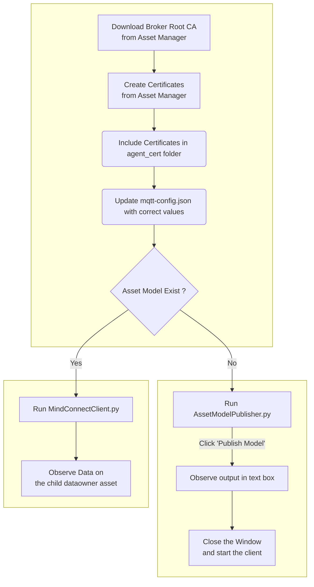

# MindConnect MQTT

Sample python code for getting started to securely connect your MindConnect MQTT on-site devices in a scaleable manner to Insights Hub. 

By cloning or downloading this repository, you accept the Development License Agreement, which can be found at https://documentation.mindsphere.io/MindSphere/license.html 

## Features

- Use MQTT certificates to connect to Insights Hub. 
- Define Asset Model and publish for model creation and instantiation.
- Ingesting timeseries data, events and uploading files to Insights Hub. 

## General Steps for using MQTT Client

Steps to Follow for configuring the sample mqtt client


## Configuration Demo Video
Below video can be referred for setup and installation of this example Demo

https://github.com/mindsphere/mindconnect-mqtt/assets/127416737/1d0dfe9d-cd71-43f9-9317-e73a84ca679a


## Configuration Steps
The configuration steps are based on the above flow chart. Each Flow chart block is explained in detailed manner.

### Creating Client Certificates
Certificates needs to be generated before connecting the client to MQTT Broker. Below documentation guides through creation of MQTT certificates. 

**Autogenerate certificate**

For simpler and general understanding, start with auto generated certificates.
https://documentation.mindsphere.io/MindSphere/howto/howto-obtaining-auto-generated-agent-certificate.html

**Bring your own certificate**

For added security the preferred approach is bring your own certificates.
https://documentation.mindsphere.io/MindSphere/howto/howto-managing-ca-certificates.html


Save the generated certificate and private key in the `agent_cert` folder. 

### Downloading Broker Root CA Certificate
Download the broker certificate from Insights Hub.
Screen navigation as below:

> Asset Manager -> Connectivity -> Manage MQTT certificates -> Broker Root CA -> Download broker certificate. 

Save the `Broker CA Certificate` in the `agent_cert` folder. 


> There are two certificates and one private key, all three are required to connect the agent to Broker. All three need to be placed in folder `agent_cert` 
- Broker Root CA
- Client Certificate
- Client Private Key


### Updating agent configuration
The configuration for connecting the client to MQTT Broker should be updated before starting the client. 
Update the [mqtt-config.json](configs/mqtt-config.json) file from folder `configs` with valid values.

Below config properties should contain valid values:
- CLIENT_ID: tenantId_AgentName. On selecting a certificate the agent name apears on right side of screen
- TENANT_ID: tenant id 
- CA_PATH : relative path to broker root CA certificate
- DEVICE_CERT_PATH: relative path for the device certificate
- DEVICE_KET_PATH: relative path for the device key

### Installation

Install latest Python version and install the dependencies using below command. 
run `pip install -r requirements.txt`

Verify the valid certificates in the `agent_cert` folder and [mqtt-config.json](configs/mqtt-config.json) file is updated with the correct values.


### Publishing Asset Model and Instantiation
This example provides sample json to publish Asset Model and instantiate it to create the aspects, asset types and assets along with the mappings. 

The example_json folder consists of sample jsons of asset model, instance and timeseries data. This example demonstrates Connect & Ingest to InsightsHub using these jsons. Later these jsons can be modified as per requirements.

The json files consists of placeholders enclosed in <>. The values are replaced in the code using the configuration and auto generated values. 

For asset model's instance to be created, delete the `instance.conf` file for the first run (If Present in main directory). 

Follow below steps to publish Asset Model
- Run `python AssetModelPublisher.py`
    - On successful connection to broker, observe the log  `Connection returned result: 0` on the console. The console log shows `Connected !!!`.
- Click on `Publish Model`
    - Console logs show the payload and topics details
- Observe the output
    - The response is displayed on the text box.
- Close the window


> Please note: Model Instance need not be created right now, it is expected to get created once MindConnectClient connects to the broker. 

Once the model is created, instance will be created automatically on start-up of the agent. 

The client uses the file `instance.conf` to check if the instance was created. The file should not exist for the very first run of client. It gets created on the first run of the client after successful connection with broker. Once the instance is created subsequent connects will not trigger instance creation.


Reference for Asset Model Definition: 
https://documentation.mindsphere.io/MindSphere/howto/howto-create-data-model-mqtt-agent.html


### Starting the Client

Run the agent python file using command: `python MindConnectClient.py`

On successful connection to broker, observe the log  `Connection returned result: 0` on the console. 
The console log shows `Connected !!!`.

The client demonstrates periodic invocation of below functionalities, it can be observed on InsightsHub:
- Timeseries data ingest
- Ingest Events of type SensorInterruptEvent
- File Upload 
- Request JWT token
- Upload file to datalake using requested token


Event ingestion requires custom event type `SensorInterruptEvent`.
Use the below payload to create custom event type:

```json
{
    "name": "SensorInterruptEvent",
    "parentId": "core.connectivity.event.type.AgentBaseEvent",
    "ttl": 35,
    "scope": "LOCAL",
    "fields": [{
            "name": "utilizedPercentage",
            "filterable": true,
            "required": false,
            "updatable": true,
            "type": "INTEGER"
        },
        {
            "name": "measurements",
            "filterable": true,
            "required": false,
            "updatable": true,
            "type": "DOUBLE"
        }
    ]
}
```

Event type and event upload payload reference:
https://documentation.mindsphere.io/MindSphere/howto/howto-agent-upload-data.html#uploading-events

Sending data from MQTT reference: https://documentation.mindsphere.io/MindSphere/howto/howto-send-data-from-mqtt-agent.html

## Modifying the example JSON's
On successful understanding of connect and ingest MQTT agent, the example JSON's can be modified as per requirements. 

The JSON contains certain placeholder which are replaced in the code referenced by `<>`.

---
[Asset Model Payload](example_json/asset_model.json) 
This is a sample JSON to create `JetPumpModel`. This model contains `JetPumpType` Asset Type, `dht11Aspect` Aspect with `temperature` and `humidity` variables. 

Asset heirarchy is defined to create a dataowner asset as child asset of the agent. 

Data point mappings are created for `temperature` and `humidity` with the data owner asset. 

The sample JSON can be modified and accordingly the code can be updated to replace the values at runtime. The model name is configurable in the `mqtt-config.json` file (`MODEL_NAME` key).

Placeholder variables in `asset_model.json`
- `<uuid>` - It is random generated uuid 
- `<tenantId>` - It is tenant id

---
[Instance Payload](example_json/instance.json) 
This sample JSON uses `JetPumpModel` to instantiate for the current client. Once instantiation message is sent the desired Asset Model gets created in InsightsHub. 

The sample JSON can be modified as per the model defined and accordingly the code can be updated to replace the values at runtime.

Placeholder variables in `instance.json`
- `<uuid>` - It is random generated uuid 
- `<model_name>` - It is model name used for instantiation, uses value from `mqtt-config.json` file.

---
[Timeseries Payload](example_json/timeseries.json)
This sample JSON uses the mapped datapoints to ingest data. 

The sample JSON can be modified as per the data point mappings done in model and accordingly the code can be updated to replace the values at runtime.

Placeholder variables in `timeseries.json`
- `<curr_date_time>` - It is replaced by current date time
- `<temperature>` - It is replaced by random integer value
- `<humidity>` - It is replaced by random integer value

---
[Event Payload](example_json/event.json) 
This sample JSON uses the event payload for the event type `SensorInterruptEvent`. 

The sample JSON can be modified as per the defined eventType and accordingly the code can be updated to replace the values at runtime.

Placeholder variables in `event.json`
- `<uuid>` - It is random generated uuid 
- `<uuid_hex>` - It is random generated uuid's hex value 
- `<curr_date_time>` - It is replaced by current date time
- `<severity>` - It is random generated severity for the event
