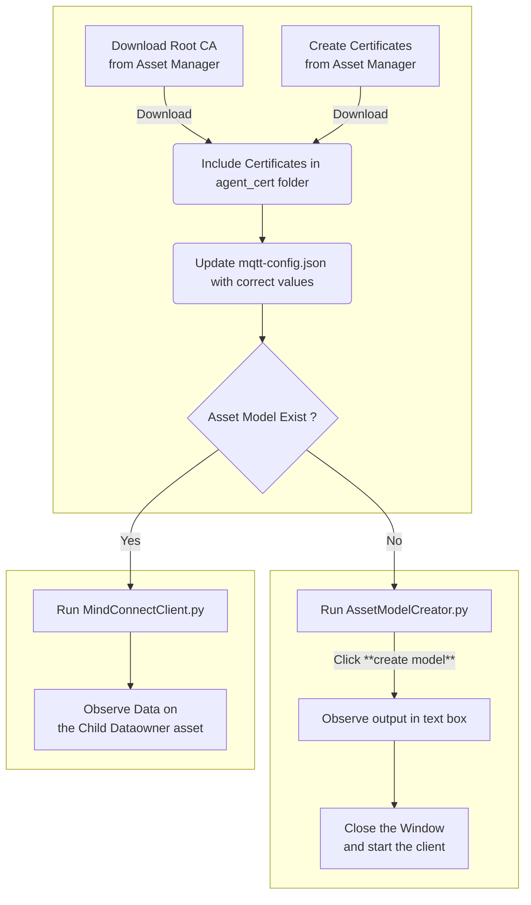

# MindConnect MQTT

Sample python code for getting started to securely connect your MindConnect MQTT on-site devices in a saleable manner to Insights Hub. 

By cloning or downloading this repository, you accept the Development License Agreement, which can be found at https://documentation.mindsphere.io/MindSphere/license.html 

## Features

- Use MQTT certificates to connect to Insights Hub. 
- Use Asset Modeler for model creation and instantiation.
- Ingesting timeseries data, events and uploading files to Insights Hub. 

## General Steps for using MQTT Client

Steps to Follow for configuring the sample mqtt client


## Configuration Steps

### Creating Certificates
Certificates needs to be generated before connecting the client to MQTT Broker. Below documentation guides through creation of MQTT certificates. 

**Autogenerate certificate**
For simpler and general understanding, start with auto generated certificates.
https://documentation.mindsphere.io/MindSphere/howto/howto-obtaining-auto-generated-agent-certificate.html

**Bring your own certificate**
For added security the preferred approach is bring your own certificates.
https://documentation.mindsphere.io/MindSphere/howto/howto-managing-ca-certificates.html


Save the generated certificates in the `agent_cert` folder. 

Download the broker certificate from Insights Hub.
Screen navigation as below:
Asset Manager -> Connectivity -> Manage MQTT ertificates -> Broker Root CA -> Download broker certificate. 

There are 2 certificates and one private key, all three are required to connect the agent to Broker. 
- Broker Root CA
- Client Certificate
- Client Private Key


### Updating agent configuration
The configuration for connecting the client to MQTT Broker should be updated before starting the client. 
Update the `mqtt-config.json` file from folder `configs` with valid values.

Below config properties should contain valid values:
- CLIENT_ID: tenantId_AgentName. On selecting a certificate the agent name apears on right side of screen.  
- DEVICE_NAME: device name, can be same as client id
- TENANT_ID: tenant id 
- CA_PATH : relative path to broker root CA certificate
- DEVICE_CERT_PATH: relative path for the device certificate
- DEVICE_KET_PATH: relative path for the device key

### Installation

Install Python latest version and install the dependencies using below command. 
run `pip install -r requirements.txt`

Verify the valid certificates in the `agent_cert` folder and `mqtt-config.json` file is updated with the correct values.

### Creating Asset Model and Instantiation
This example provides sample json to create Asset Model and instantiate it to create the aspects, asset types and assets along with the mappings. 

The example_json folder consists of sample jsons to create asset model, instance and timeseries data. This example demonstrates Connect & Ingest to InsightsHub using these jsons. Later these jsons can be modified as per requirements.

The json files consists of placeholders enclosed in <>. The values are replaced in the code using the configuration and auto generated values. 

For asset modeler instance to be created, delete the `instance.conf` file for the first run (If Present in main directory). 

Follow below steps to create Asset Model
- Run `python AssetModelCreator.py`
- Click on `create model`
- Observe the output on the text box
- Close the window

On successful connection to broker, observe the log  `Connection returned result: 0` on the console. 
The console log shows `Connected !!!`.

> Please note: Instance need not be created right now, it is expected to get created once MindConnectClient connects to the broker. 

As model is created, the instance will be created automatically on start-up of the agent. 

The client uses the file `instance.conf` to check if the instance was created. The file should not exist for the very first run of client. It gets created on the first run of the client after successful connection with broker. Once the instance is created subsequent connects should not trigger instance creation.


Reference for Asset Model creation: 
https://documentation.mindsphere.io/MindSphere/howto/howto-create-data-model-mqtt-agent.html

### Starting the Client

Run the agent python file using below command:

Command: `python MindConnectClient.py`

On successful connection to broker, observe the log  `Connection returned result: 0` on the console. 
The console log shows `Connected !!!`.

The client demonstrates periodic invocation of below functionalities, it can be observed on InsightsHub:
- Timeseries data ingest
- Ingest Events of type SensorInterruptEvent
- File Upload 
- Request jwt token
- Upload file to datalake using requested token


Event ingestion requires custom event type `SensorInterruptEvent`.
Use the below payload to create custom event type:

```json
{
    "name": "SensorInterruptEvent",
    "parentId": "core.connectivity.event.type.AgentBaseEvent",
    "ttl": 35,
    "scope": "LOCAL",
    "fields": [{
            "name": "utilizedPercentage",
            "filterable": true,
            "required": false,
            "updatable": true,
            "type": "INTEGER"
        },
        {
            "name": "measurements",
            "filterable": true,
            "required": false,
            "updatable": true,
            "type": "DOUBLE"
        }
    ]
}
```

Event type and event upload payload reference:
https://documentation.mindsphere.io/MindSphere/howto/howto-agent-upload-data.html#uploading-events

Sending data from MQTT reference: https://documentation.mindsphere.io/MindSphere/howto/howto-send-data-from-mqtt-agent.html

## Modifying the example jsons
On successful understanding of the flow on connect and ingest MQTT agent, the example jsons can be modified as per requirements. 
The json contains certian placeholder which are replaced in the code. 
