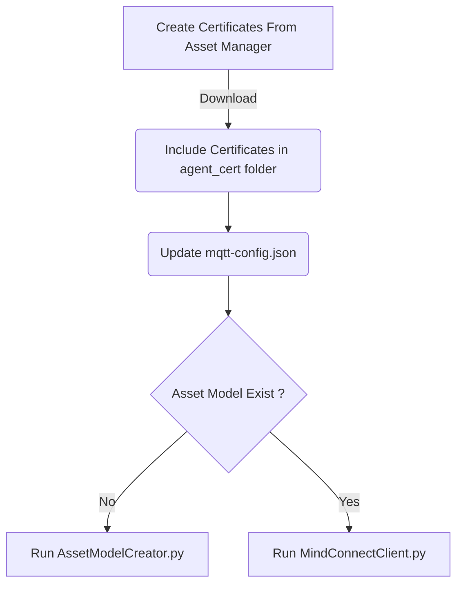

# MindConnect MQTT

Sample python code for getting started to securely connect your MindConnect MQTT on-site devices in a saleable manner to Insights Hub. 

By cloning or downloading this repository, you accept the Development License Agreement, which can be found at https://documentation.mindsphere.io/MindSphere/license.html 

## Features

- Use mqtt certificates to connect to Insights Hub. 
- Use Asset Modeler for model creation and instantiation.
- Ingesting timeseries data, events and uploading files to Insights Hub. 

## General Steps for using MQTT Client

Steps to Flow for configuring the sample mqtt client

## Configuration Steps

### Creating Certificates
The certificates needs to be generated before connecting the device to MQTT Broker. Below documentation guides through creation of MQTT certificates. 

**Bring your own certificate**
https://documentation.mindsphere.io/MindSphere/howto/howto-managing-ca-certificates.html

**Autogenerate Certificate**
https://documentation.mindsphere.io/MindSphere/howto/howto-obtaining-auto-generated-agent-certificate.html

The generated certificates needs to be placed in the `agent_cert` folder. 
There are 2 certificates and one private key. All three are required to connect the agent to Broker. 
- Broker Root CA
- Device Certificate
- Private Key

### Updating agent configuration
The configuration for connecting the client to MQTT Broker should be updated before starting the client. 
Below config properties should contain valid values:
- CLIENT_ID: client id for the agent 
- DEVICE_NAME: device name 
- TENANT_ID: tenant id 
- DEVICE_CERT_PATH: relative path for the device certificate
- DEVICE_KET_PATH: relative path for the device key

### Installation

Install Python latest version and install the dependencies using below command. 
run `pip install -r requirements.txt`

Place the certificates in the `agent_cert` folder. 
Update the `mqtt-config.json` file from folder `configs` with valid values.

### Creating Asset Model and Instantiation
This example provides sample to create Asset Model and Instantiate it to create the aspects, asset types and assets along with the mappings. 

The example_json folder consists of sample jsons to create asset model, instance and timeseries data.

The jsons consists of placeholders enclosed in <>. The values are replaced in the code using the configuration. 

For asset modeler instance to be created, delete the `instance.conf` file for the first run (If Present). 

Run Asset Modeler for creation of model. 
Command: `python AssetModelCreator.py`
Click on the button `create model`. 

> Please note: Instance need not be created right now, it is expected to get created once client connects to the broker. 

After model is created, the instance will be created automatically on start-up of the agent. 

The client uses the file `instance.conf` to check if the instance was created. The file should not exist for the very first run of client. It gets created on the first run of the client after successful connection with broker. Once the instance is created subsequent connects should not trigger instance creation.

Reference for Asset Model creation: 
https://documentation.mindsphere.io/MindSphere/howto/howto-create-data-model-mqtt-agent.html

### Starting the Client

Run the agent python file `MindConnectClient.py` for the connection to be established.

Command: `python MindConnectClient.py`

We should get connected status `0` on the console after the client starts running. 

Reference: https://documentation.mindsphere.io/MindSphere/howto/howto-send-data-from-mqtt-agent.html
